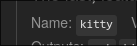

# Table of contents

- [Installation Guide](#installation-guide)
  - [Optional steps](#optional-steps)
  - [Networking](#networking)
    - [Ethernet](#ethernet)
    - [Wi-Fi](#wi-fi)
  - [Partitioning and Formatting](#partitioning-and-formatting)
  - [Mounting](#mounting)
  - [Configuration](#configuration)
    - [Configuration options](#configuration-options)
      - [Boot options](#boot-options)
      - [User configuration](#user-configuration)
      - [Networking](#system-networking)
      - [nixos-hardware](#nixos-hardware)
      - [hardware-configuration.nix file](#hardware-configuration-nix-file)
      - [Packages](#packages)
  - [Last steps](#last-steps)
  - [Finish](#finish)
  - [Navigation](#navigation)

# Installation Guide

This guide will explain how to install the minimal version of NixOS, which does
not come with any desktop environment/window manager. You will have to install
everything yourself.

I trust you know how to make a bootable USB. You can download the ISO
[here](https://nixos.org/download/), at the bottom of the page.

## Optional steps

There are a few things that I would recommend when first booting into the
installation environment.

1. Most of the commands that you will be using require root privileges. For that
   reason, type `sudo -i` into the terminal. This changes your logged-in user to
   root, and you don't have to type `sudo` with every command anymore.
2. Switch to your preferred keyboard layout. You can find all available layouts
   with:
   ```
   find -L /etc/kbd/keymaps -type f -name '*.map.gz'
   ```
   - `-L` - follows symlinks. NixOS stores layouts in the `/nix/store` folder
     and links them to `/etc/kbd/keymaps` - this folder is much smaller to parse
     through than `/nix/store`, that's why we use it as the target path.
   - `-type f` - only matches regular files.
   - `-name '*.map.gz'` - match any file ending with `.map.gz`.

   Of course you can pipe the output through `grep` or `less` if you want.

   After you find your desired layout, you can set it with
   `loadkeys <name_of_the_layout>`.

3. Make the font larger or smaller. Again, you can find fonts with this command:

   ```
   find -L /etc/kbd/consolefonts -type f
   ```

   Or just use a `ter-vXXn`, where XX stands for font size: 12, 14, 16, 18, 20,
   22, 24, 28, 30, and 32. The default is 16.

   You can change the font with `setfont <name_of_font>`.

## Networking

To install the system you need internet connection.

### Ethernet

If you're using an Ethernet cable, you're all set. You can move on to the next
step.

### Wi-Fi

Begin by starting the Wi-Fi service, with `systemctl start wpa_supplicant`.
There is no `NetworkManager` in this installer, so you have to work with
lower-level services, instead. `wpa_supplicant` handles connecting to Wi-Fi
using WPA.

After that, run `wpa_cli`. This allows you to choose a network and provide a
password.

`add_network` - this creates a network with the ID returned. On my machine the
ID is 0.

`set_network 0 ssid "name_of_your_network"` - set the SSID of the network
created by `add_network`.

`set_network 0 psk "password_of_your_network"` - set the PSK to the password of
your network.

`enable_network 0` - enable the connection.

You should see something like this when the connection is successful:
`<3>CTRL-EVENT-CONNECTED - Connection to 32:85:ab:ef:24:5c completed [id=0 id_str=]`.

You can leave `wpa_cli` with `quit`.

## Partitioning and formatting

This process doesn't really differ from other Linux distros. That's why I will
skip describing this step for now, and focus on things that you don't see on
other systems.

I will eventually add some examples such as a basic EXT4 setup, btrfs,
encryption, etc. It's on my to-do list.

One thing that I will mention is that depending on the type of file system you
choose, you might need to add the kernel module necessary to mount that file
system. Add the necessary modules to the `boot.initrd.kernelModules` list. For
example:

```
boot.initrd.KernelModules = [ "btrfs" ];
```

`nixos-generate-config` should add the necessary modules, but it's worth
checking the `/mnt/etc/nixos/hardware-configuration.nix` file just in case.

## Mounting

You should follow these steps right after you finish making the file systems
with `mkfs`.

When mounting partitions, I tend to omit options since I can do that later in
the configuration file anyway, which is a bit easier than writing long commands.

First, mount the root partition to `/mnt` with:

```
mount /dev/<partition_name> /mnt
```

Next, create the `/boot` folder and mount the boot partition to it:

```
mkdir -p /mnt/boot
mount -o umask=077 /dev/<partition_name> /mnt/boot
```

- the `-p` flag creates parent folders if they don't exist.
- the `-o` flag allows you to provide options for the mount command. Here:
  `umask=077`, which means that only the owner of the directory (root here) will
  have access to it. It creates `rwx------` permissions.

Mount all other partitions you want.

## Configuration

Now for the fun part - configuration!

First you need to create the config files with:

```
nixos-generate-config --root /mnt
```

This will scan your system for devices, storage, your partition setup, etc., and
write all of that to the configuration files.

- `--root /mnt` - this flag tells the command where the root partition is. It
  will ignore files outside the given directory. The configuration files will be
  written to `/mnt/etc/nixos`

### Configuration options

Now, open the `/mnt/etc/nixos/configuration.nix` file with `nano` or `vim`. What
I aim here for is a system that boots. I would recommend leaving full
configuration for after the installation is done.

#### Boot options

First, find the `boot` options and select a bootloader. I normally opt for
`systemd-boot` as I'm using UEFI systems. If you do the same, you should check
out
[extra options](https://mynixos.com/nixpkgs/options/boot.loader.systemd-boot).
Although, I don't think it's necessary at this point.

If you choose GRUB, you should set `boot.loader.grub.device` to `nodev`, and
`boot.loader.grub.efiSupport` to `true`. The former will generate the GRUB boot
menu without installing GRUB, and the latter enables EFI support.

Systemd-boot should find any other OSes that are installed and add them to the
list without extra configuration. GRUB needs `boot.loader.grub.useOSProber` set
to `true`.

#### User configuration

You should uncomment the `users.users.alice` code block, and change `alice` to
the name of your choice.

- `isNormalUser` defines if the user is a 'real' user. It makes sure the home
  directory is created, and the user is added to the `users` group.
- `extraGroups` is a list of other groups that the user will be added to.
  Example: `[ "wheel" "docker" "xyz" ]`. White-space doesn't matter.
- `packages` is also a list, this time of packages installed and available to
  that user. Same syntax as above. You can find the package names
  [here](https://search.nixos.org/packages). You find the package you want and
  take the name of it. Example:

  

#### System networking

**IMPORTANT!!** Uncomment the `networking.hostName` line and set it to the value
of your choosing - the name of the device on the network. This will also be used
for rebuilding when you use a configuration with multiple devices, but I'll
explain that somewhere else.

Set `networking.networkmanager.enable` to `true`. Also, add the `networkmanager`
group to your users in the `extraGroups` list, so the user can manage the
connections.

For WiFi, uncomment the `networking.wireless.enable = true` line to enable the
`wpa_supplicant`. You could, in theory, define the networks in the
configuration, but I wouldn't recommend it as it's going to be stored in
plaintext. When no networks are defined, `wpa_supplicant` will default to its
configuration file `/etc/wpa_supplicant.conf` which you should edit. Or use the
commands you used before for the installer.

#### nixos-hardware

[nixos-hardware](https://github.com/NixOS/nixos-hardware) is a repository
containing a list of profiles (predefined settings) for various devices. It's
worth going through the repo and checking if there is one for your device.
Instructions on how to use it are in the repo.

#### hardware-configuration.nix file

`hardware-configuration.nix` file shouldn't be edited. Some people swear by
this, some ignore it. This file will be regenerated every time you use
`nixos-generate-config`, which you might do when you add a drive, or change some
other component. Anything you want to put in that file, you can put in the
`configuration.nix` file, since `hardware-configuration.nix` is imported to it
anyway.

Personally, I edit it anyway. Especially because `nixos-generate-config` doesn't
seem to like picking up mount options for `btrfs`. So I had to add them myself.

Speaking of, please open the `hardware-configuration.nix` file and check if all
mount options, `fsType`, etc. make sense and are correct.

#### Packages

There is also a `environment.systemPackages` line. This one installs packages
for all users, system-wide. It's a list that follows the same syntax as
`packages` in the users block.

## Last steps

After you're done with configuring the system, type `nixos-install` and be
patient. This will install the system based on your configuration. If any issues
were to occur, you can re-run `nixos-install` after you fix them, as many times
as you need, until it installs.

`nixos-install` will ask you to set a password for the root user.

If you declared a normal user, and plan on logging into it, you need to set a
password for that user.

```
nixos-enter --root /mnt -c 'passwd alice'
```

- `nixos-enter` allows you to run a command in a NixOS chroot environment. In
  other words, in a system that you're not currently booted into.
- `--root` defines the path to the root of the other system. Here: `/mnt`.
- `-c` allows you to provide a bash command to execute, the `passwd` command.
  Please replace the user name with the user name you defined in the
  configuration.

## Finish

All done! Type `reboot` and hope for the best!

GRUB / Systemd-boot will populate their menu with different versions of the
system. After the above reboot, there will be only one version. If you keep
configuring the system and you mess up, you will be able to boot into a previous
working version.

## Navigation

- [Nixos Overview](/nixos/README.md)
